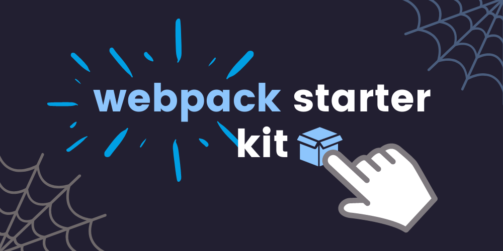

# Webpack Starter Kit 🧰

Simple webpack 4 starter kit for basic projects.

## Table of Content

* [Features](#features)
* [Usage](#Usage)
* [Available scripts](#Available-scripts)
* [Requirements](#requirements)
* [Project tree](#project-tree)
* [Used packages](#used-packages)

## Features

* Eslint
* Prettier
* Jest
* PWA
* Sass
* ES6
* Asset loading
* CSS prefixing
* Dev server
* Sourcemaps
* Icon generator for PWA

## Requirements

* Installed fresh version of [**Node.js**](https://nodejs.org/en/) and [**yarn**](https://yarnpkg.com/)
>**TIP:** For managing node.js versions I recommend to use [**n**](https://github.com/tj/n) a simple Node.js version management

## Usage

Click on `Use this template` button and follow instructions, next clone it to your desired directory on your computer, go to the project directory in console and type `yarn install`. Now you can start developing your new awesome project 🔥🔥🔥

## Available scripts

`yarn dev` - runs development mode

`yarn build` - runs build process for production

`yarn test` - runs jest tests

`yarn setup-icons` - automates PWA asset generation and image declaration

`yarn test-report` - build coverage report

`yarn publish` - runs build process and publish the page using `gh-pages` branch
